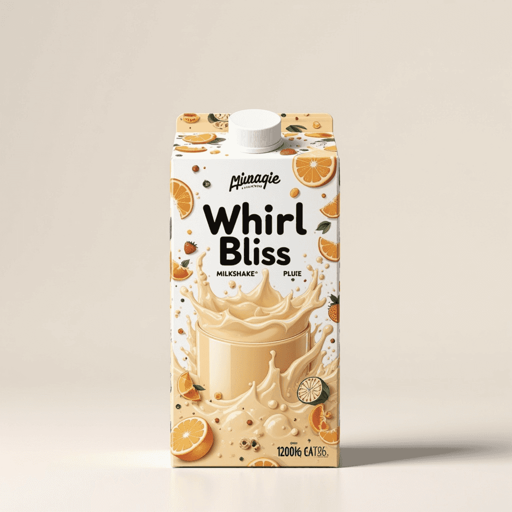
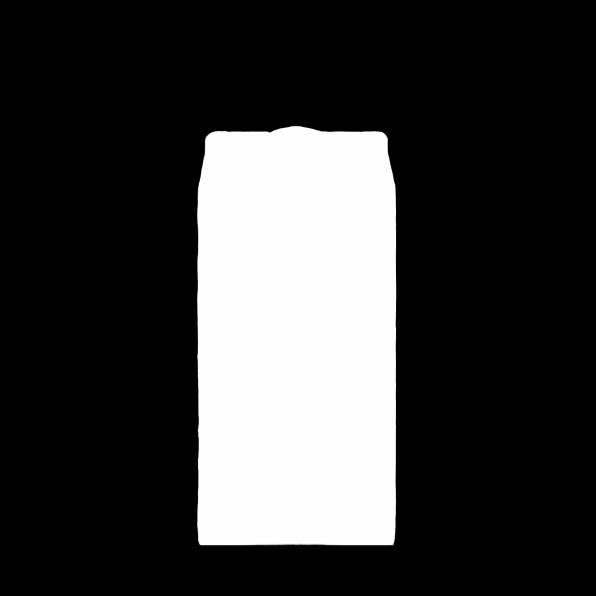
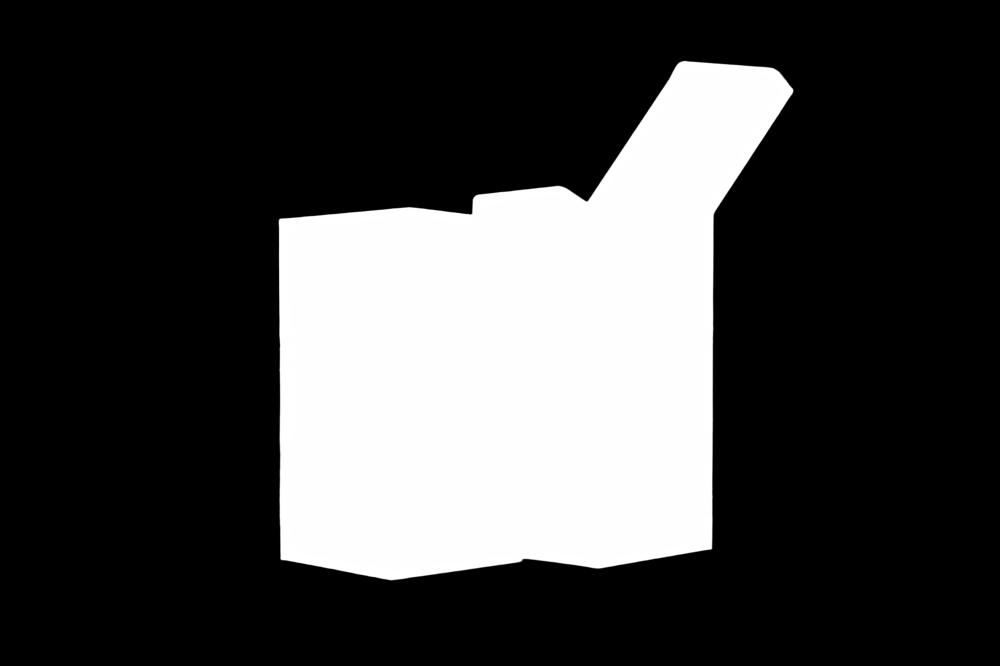
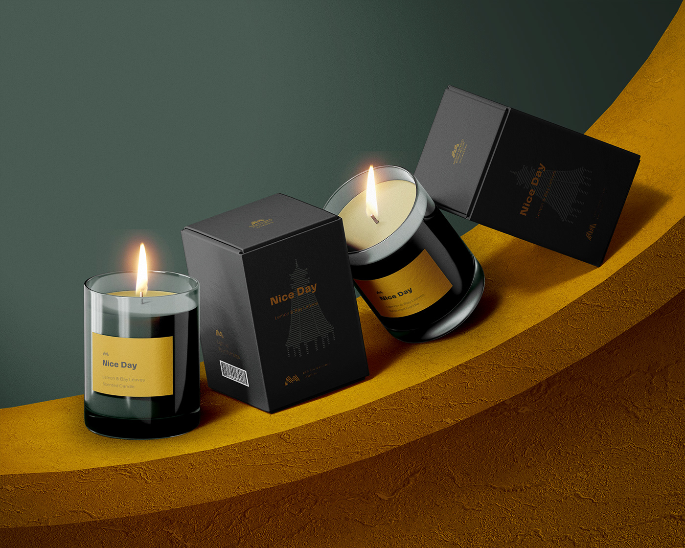
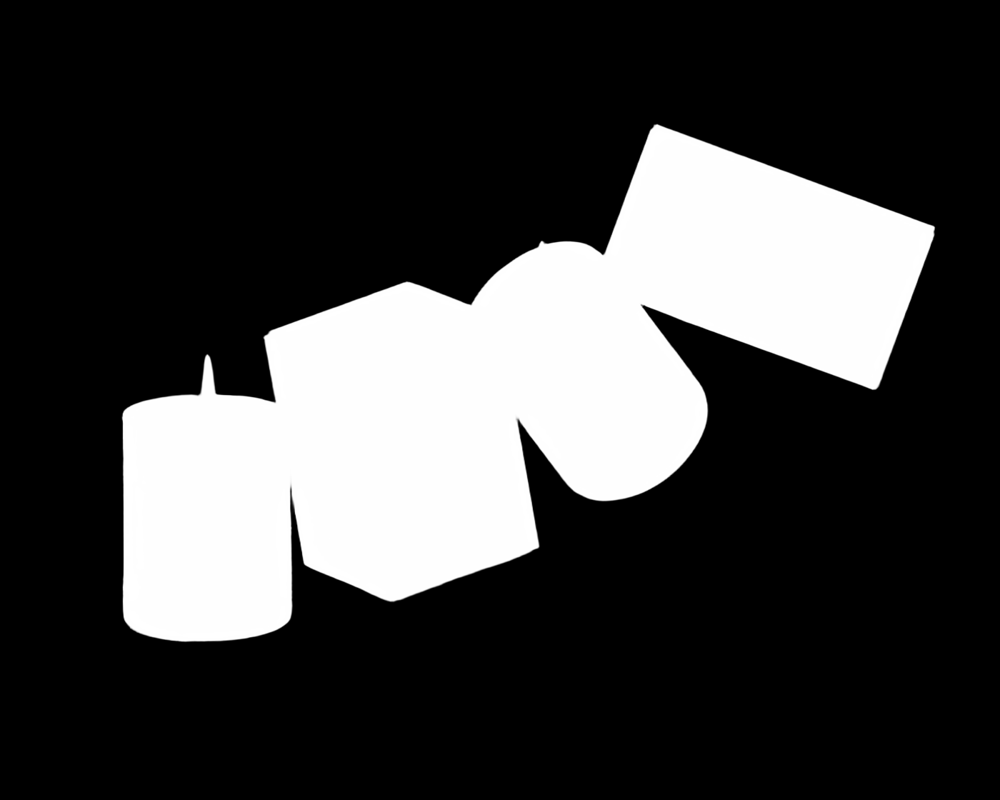
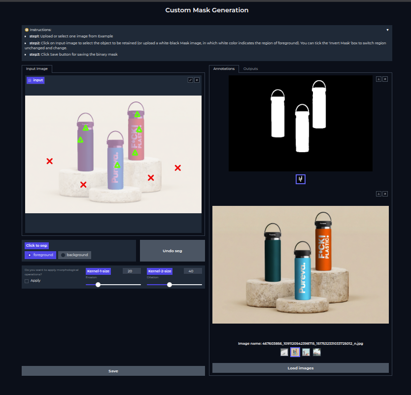

# Background-Remover
Removing the background given an image. In this case, an object of interest is defined as the foreground object

  
  

  
  

  
  

## Techniqual Details

- **MVANet** model was fine-tuned on a custom training dataset
- Real images (1,000) + Synthetic images (3,000) were used to train the model
- Real product images were annotated using custom built annotation tool.

### Custom Annoation Tool

- Built using Gradio-UI
- **HQ-SAM** ( variant of Segment Anything Model ) is used as the main model for the segmentation
- Allow to highlight background keypoints and foreground keypoints in order to obtain accurate segmentation maks
- Binary masks or gray-scale masks can be saved

